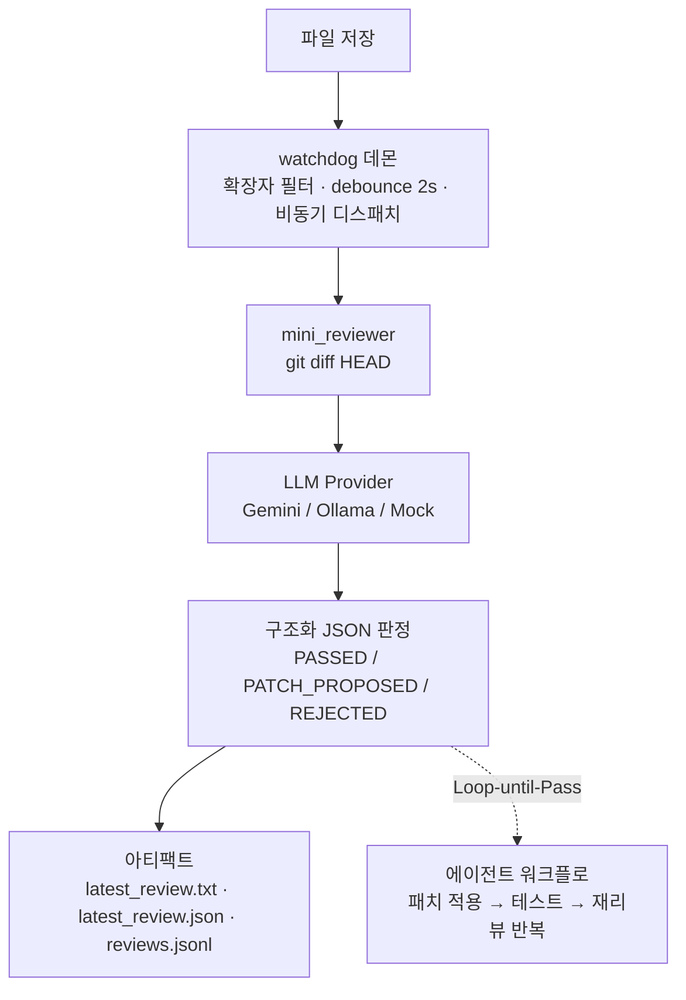

# Nitpicker Daemon

> **Save-triggered AI code review daemon** — 파일을 저장하는 순간 diff를 분석해, 구조화된 JSON 리뷰(통과/패치 제안/거부)를 돌려주는 로컬 AI 리뷰 데몬입니다.
> "AI가 만든 코드를 그대로 믿지 않는다"는 원칙을 시스템으로 강제하기 위해 만들었습니다.

**한눈에 보는 결과**

| 항목 | 내용 |
|---|---|
| 동작 방식 | 파일 저장 → watchdog 감지 → `git diff` → LLM 리뷰 → 구조화 JSON 판정 |
| 판정 체계 | `REVIEW_PASSED` / `PATCH_PROPOSED`(unified diff 포함) / `REVIEW_REJECTED` |
| 강제 규칙 | Fail-Fast · Hot-path I/O 금지 · Strict Typing · Concurrency Safety (4대 핵심 규칙) |
| 테스트 | pytest 39/39 통과 (동시성·엣지케이스·sad-path 포함) |
| 프로바이더 | Gemini API · Ollama(로컬 LLM) · Mock — adapter 경계로 교체 가능 |
| 감사 추적 | append-only JSONL 로그 + 최신 리뷰 아티팩트(txt/json) |

## 왜 만들었나

LLM 코딩 도구는 빠르지만, 출력 품질은 흔들립니다. 리뷰를 사람의 기억과 성실함에 맡기는 대신,
**저장 이벤트마다 자동으로 실행되는 독립 리뷰 게이트**를 두어 아키텍처 제약을 기계적으로 강제하는 것이 목표입니다.
리뷰 결과는 사람이 읽는 요약과 자동화가 소비하는 JSON으로 동시에 남습니다.

**계보** — 이 리포는 단발 실험이 아니라 진화의 한 단계입니다:
AutoUTube의 "18계명" 시스템 프롬프트 리뷰어(Hard-Gating + 컨텍스트 주입 + PASS 시 자동 커밋, 2026-03)
→ 다중 AI 합의 리뷰(ZTR, Writer-Critic 교차 + 하네스 H1~H6)
→ **본 리포: 18계명을 실무형 4대 핵심 규칙으로 수렴시킨 저장-트리거 데몬**
→ 이후 협업 규약 방법론(cubi-skills)과 AI 개발 스위트로 확장. 상세: `config/rules/RULES.md`

## 아키텍처



**Layer 2 (오케스트레이터, 진행 중)**: 역할별 에이전트(fast_gate·security·architecture·performance 등 9종),
ConsensusEngine(투표 집계), ResourceManager(동시 실행 예산), SQLite 작업 영속화, ZeroMQ IPC — 
단일 리뷰어를 다중 에이전트 합의 구조로 확장하는 스캐폴드가 구현되어 있습니다. (완료 항목/진행 항목은 로드맵 참조)

## 설계 원칙

- **Fail-Fast**: 예외 삼킴 금지 — 리뷰어 자신도 이 규칙으로 리뷰받습니다
- **판정의 재현성**: 스타일 지적은 advisory로 격하, 블로커만 REJECT — 요약뿐인 거부는 스키마 차원에서 금지
- **감사 가능성**: 모든 리뷰는 append-only JSONL로 축적 (무엇을, 언제, 왜 거부했는지 추적 가능)
- **경계 분리**: provider/agent/service가 adapter·ABC 경계로 분리되어 로컬 LLM ↔ API 교체가 설정 한 줄

## 빠른 시작

```bash
# 1. 설정 (API 키는 gitignore된 로컬 파일에만)
copy config\nitpicker.local.example.json config\nitpicker.local.json

# 2. 환경 구성 + 데몬 시작
Set_Env.bat && Run_Daemon.bat

# 3. 테스트
Run_Tests.bat   # pytest 39/39
```

## 기술 스택

Python · watchdog · Gemini API / Ollama · ZeroMQ · SQLite · pytest · structured output(JSON schema)
